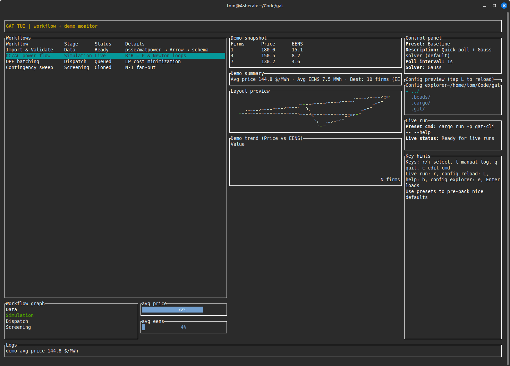

# GRID ANALYSIS TOOLKIT (GAT) — v0.5.7

**📖 [Documentation](https://monistowl.github.io/gat/) | 🚀 [Quickstart](https://monistowl.github.io/gat/guide/quickstart/) | 📚 [Guide](https://monistowl.github.io/gat/guide/) | 🔧 [Internals](https://monistowl.github.io/gat/internals/) | 📋 [Reference](https://monistowl.github.io/gat/reference/)**

*A fast Rust-powered command-line toolkit for power-system modeling, flows, dispatch, and time-series analysis.*

If you're comfortable running simple CLI commands and want to start doing *real* grid analysis — without needing a giant Python stack or a full simulation lab — **GAT gives you industrial-grade tools in a form you can actually tinker with.** Everything runs as standalone commands, and all the heavy lifting is Rust-fast.

## Table of Contents

- [Why GAT?](#why-gat)
- [Installation](#installation)
- [Interfaces](#interfaces)
- [Quick Start](#quick-start)
- [CLI Reference](#cli-reference)
- [Common Workflows](#common-workflows)
- [Documentation](#documentation)
- [Architecture & Crates](#architecture--crates)

---

## Why GAT?

### For Beginners

* Start with *one command at a time*
* Outputs are Parquet/Arrow/CSV — easy to open in Python, R, DuckDB, Polars
* Commands behave like Unix tools: pipeable, scriptable, reproducible

### For Advanced Users

* Full DC/AC power-flow solvers (Newton-Raphson with Q-limit enforcement)
* DC/AC optimal power-flow (OPF) with polynomial/piecewise costs
* **Full nonlinear AC-OPF** with two backends:
  - L-BFGS penalty method (pure Rust, portable, no external dependencies)
  - IPOPT interior-point (analytical Jacobian/Hessian, **all 68 PGLib cases validated with <0.01% gap**)
* N-1/N-2 contingency analysis and screening
* **GPU acceleration** for Monte Carlo, contingency screening, and sensitivity analysis (wgpu)
* Time-series resampling, joining, aggregation
* State estimation (weighted least squares)
* **Distribution automation** (FLISR/VVO/outage coordination via ADMS)
* **DER analytics** (envelope aggregation, pricing-based scheduling via DERMS)
* **Distribution system modeling** (hosting-capacity analysis, AC OPF)
* **Interactive terminal UI** (TUI) for workflows, datasets, pipelines, and batch jobs
* **Reliability metrics** (LOLE, EUE, deliverability scores)

### Why Rust?

Rust gives you C-like execution speed without unsafe foot-guns. For grid models with thousands of buses/branches, that matters. Even on a laptop.

GAT scales with you:

* Two lines for a DC power flow
* A thousand AC-OPF scenarios on 20 machines when you need throughput
* All without Conda, Jupyter, or heavyweight clusters

---

## Installation

### Quick Install (Recommended)

The modular installer lets you choose components on the fly and installs to `~/.gat` with no dependency on Rust:

```bash
curl -fsSL https://raw.githubusercontent.com/monistowl/gat/v0.5.7/scripts/install-modular.sh | bash
```

Then add to your PATH:

```bash
export PATH="$HOME/.gat/bin:$PATH"
```

#### Component Selection

By default, only the CLI is installed. Choose additional components:

```bash
# CLI + TUI (interactive dashboard)
GAT_COMPONENTS=cli,tui bash <(curl -fsSL https://raw.githubusercontent.com/monistowl/gat/v0.5.7/scripts/install-modular.sh)

# CLI + TUI + GUI dashboard (future)
GAT_COMPONENTS=cli,tui,gui bash <(curl -fsSL https://raw.githubusercontent.com/monistowl/gat/v0.5.7/scripts/install-modular.sh)

# Everything (CLI + TUI + GUI + native solvers)
GAT_COMPONENTS=cli,tui,gui,solvers bash <(curl -fsSL https://raw.githubusercontent.com/monistowl/gat/v0.5.7/scripts/install-modular.sh)
```

Or from the downloaded script:

```bash
bash scripts/install-modular.sh --components cli,tui
bash scripts/install-modular.sh --prefix /opt/gat --components cli,tui,solvers
```

#### Installation Directory Structure

Everything installs under `~/.gat/`:

```
~/.gat/
├── bin/           # Executables (gat, gat-tui, gat-gui, gat-cli)
├── config/        # Configuration (gat.toml, tui.toml, gui.toml)
├── solvers/       # Native solver binaries (gat-clp, gat-cbc, gat-ipopt)
└── cache/         # Dataset cache, run history
```

### Alternative: Bundle Variants (Full Tarball)

If you prefer bundled releases with docs, download and unpack a variant:

```bash
# Full variant (CLI + TUI + all features)
curl -fsSL https://github.com/monistowl/gat/releases/download/v0.5.7/gat-0.5.7-linux-x86_64-full.tar.gz | tar xz
cd gat-0.5.7-linux-x86_64-full
./install.sh

# Headless variant (CLI only, minimal footprint)
curl -fsSL https://github.com/monistowl/gat/releases/download/v0.5.7/gat-0.5.7-linux-x86_64-headless.tar.gz | tar xz
cd gat-0.5.7-linux-x86_64-headless
./install.sh --variant headless
```

### Build from Source (Fallback)

If no binary is available for your platform, both installers fall back to a source build. This requires Rust:

Go to https://rustup.rs to install the Rust toolchain.

Then:

```bash
# Full distribution: all solvers + TUI + visualization (~61 MB)
cargo build -p gat-cli --release --no-default-features --features dist

# Headless distribution: all solvers, no TUI/GUI (~60 MB, for servers)
cargo build -p gat-cli --release --no-default-features --features dist-headless

# Native distribution: includes IPOPT for AC-OPF (requires libipopt)
cargo build -p gat-cli --release --no-default-features --features dist-native

# Native headless: IPOPT without UI (for HPC/cluster deployments)
cargo build -p gat-cli --release --no-default-features --features dist-native-headless
```

The binary lands under `target/release/gat-cli`.

#### Distribution Feature Summary

| Feature | Solvers | TUI | Viz | IPOPT | Use Case |
|---------|---------|-----|-----|-------|----------|
| `dist` | clarabel, highs | ✓ | ✓ | — | End users (desktop/laptop) |
| `dist-headless` | clarabel, highs | — | ✓ | — | Servers, automation, CI |
| `dist-native` | clarabel, highs | ✓ | ✓ | ✓ | AC-OPF users (requires libipopt) |
| `dist-native-headless` | clarabel, highs | — | ✓ | ✓ | HPC clusters, batch AC-OPF |

#### Legacy Feature Flags

For minimal or custom builds:

```bash
# Minimal (Clarabel only, lean dependencies)
cargo build -p gat-cli --release --no-default-features --features minimal

# Custom: specific solvers + features
cargo build -p gat-cli --release --no-default-features --features "solver-clarabel,solver-highs,tui,viz"
```

### Native Solvers (Optional)

GAT v0.5.7 includes vendored COIN-OR solver binaries that run as isolated subprocesses, communicating via Arrow IPC. This eliminates unsafe FFI from the main codebase while providing access to industrial-strength solvers.

**Available native solvers:**

| Solver | Binary | Problem Type | Use Case |
|--------|--------|--------------|----------|
| CLP | `gat-clp` | LP | DC-OPF, economic dispatch |
| CBC | `gat-cbc` | MIP | Unit commitment (coming soon) |
| IPOPT | `gat-ipopt` | NLP | AC-OPF (coming soon) |

**Build native solvers from vendored sources:**

```bash
# Build CLP solver
cargo xtask build-solvers clp

# Install to ~/.gat/solvers/
cargo xtask build-solvers clp --install
```

**Use native solvers in your code:**

```rust
use gat_algo::opf::OpfSolver;

let solution = OpfSolver::new()
    .with_method(OpfMethod::DcOpf)
    .prefer_native(true)  // Use CLP if available, fall back to Clarabel
    .solve(&network)?;
```

### Shell Completions (After Installation)

Generate shell completions once `gat` is in your PATH:

```bash
gat completions bash | sudo tee /etc/bash_completion.d/gat > /dev/null
gat completions zsh --out ~/.local/share/zsh/site-functions/_gat
gat completions fish --out ~/.config/fish/completions/gat.fish
gat completions powershell --out ~/gat.ps1
```

Or source them on the fly:

```bash
source <(gat completions bash)
```

### For Development

If you're contributing to GAT:

1. Install Rust: https://rustup.rs
2. Clone the repository and run `cargo build`
3. Optional helpers:
   * `bd` — the beads issue tracker (run `bd ready` before you start work)
   * `beads-mcp` — so MCP-compatible agents can inspect docs via `gat-mcp-docs`
   * `jq` — required by `scripts/package.sh`
4. See `RELEASE_PROCESS.md` for our branch strategy (experimental → staging → main)

---

## Interfaces

GAT works the way you do. Pick your interface:

### Command Line Interface (CLI)

For scripting, batch jobs, CI/CD pipelines, and reproducible workflows.

- All features available through the `gat` CLI
- Outputs in Arrow/Parquet for downstream tools (Polars, DuckDB, Spark)
- See `docs/guide/overview.md` for command reference

```bash
gat pf dc grid.arrow -o flows.parquet
gat opf dc grid.arrow --cost costs.csv --limits limits.csv -o dispatch.parquet
gat batch pf --manifest scenario_manifest.json -d batch_results

# v0.6: Pipe JSON to stdout for downstream tools
gat pf dc grid.arrow -o - | jq '.[] | select(.flow_mw > 100)'
```

### Terminal UI (TUI)

For interactive exploration, workflow visualization, and real-time status monitoring.

The TUI is a 7-pane interactive dashboard built with Ratatui:

1. **Dashboard** — System health, KPIs (Deliverability Score, LOLE, EUE), quick-action toolbar
2. **Commands** — 19+ built-in command snippets, dry-run/execute modes, execution history, output viewer
3. **Datasets** — Catalog browser, upload manager, scenario template browser with validation
4. **Pipeline** — Workflow DAG visualization, transform step tracking, node details
5. **Operations** — Batch job monitor, allocation results, job status polling
6. **Analytics** — Multi-tab results: Reliability, Deliverability Score, ELCC, Power Flow with context metrics
7. **Settings** — Display, data, execution, and advanced preferences

Launch it with:

```bash
gat-tui
```

Or, if running from source during development:

```bash
cargo run -p gat-tui --release
```

Navigate with arrow keys, Tab to switch panes, Enter to select, Esc to close modals, `q` to quit. See `crates/gat-tui/README.md` for full keyboard shortcuts and feature details.

### GUI Dashboard (Experimental)

**Status: Work in Progress** — The GUI is functional but should be considered experimental.

A native desktop application built with Tauri 2.0 + Svelte 5 + D3.js for interactive grid visualization and analysis:

- **Grid Visualization** — Force-directed, schematic, and geographic layout modes with drag-and-drop positioning
- **Power Flow** — DC (fast linearized) and AC (Newton-Raphson) solvers with real-time results
- **DC-OPF** — DC Optimal Power Flow with LMPs and congestion detection
- **N-1 Contingency Analysis** — Security screening that identifies overloads for single-branch outages
- **PTDF/LODF Analysis** — Transfer sensitivity factors and line outage distribution factors
- **Grid Summary** — Bus/branch counts, MW totals, voltage ranges, graph statistics
- **Island Detection** — Find disconnected network components
- **Thermal Analysis** — Pre-contingency thermal headroom assessment
- **Y-bus Explorer** — Interactive admittance matrix visualization with sparsity patterns
- **JSON Export** — Full network model export for external tools

Launch from the GUI crate:

```bash
cd crates/gat-gui && pnpm install && pnpm tauri dev
```

Or build for production:

```bash
cd crates/gat-gui && pnpm tauri build
```

See `crates/gat-gui/README.md` for architecture details and keyboard shortcuts.

---

## Quick Start

### 1. Import then DC Power Flow (Fastest Starter)

```bash
gat import matpower --m test_data/matpower/edge_cases/case9.m -o grid.arrow
gat pf dc grid.arrow -o out/dc-flows.parquet
```

**What this does:**

* Converts the bundled MATPOWER case9 to Arrow
* Solves the DC approximation (linear, very fast)
* Writes a Parquet branch-flow summary

### 2. DC Optimal Power Flow (Dispatch with Costs)

```bash
gat opf dc test_data/matpower/case9.arrow \
  --cost test_data/opf/costs.csv \
  --limits test_data/opf/limits.csv \
  --piecewise test_data/opf/piecewise.csv \
  -o out/dc-opf.parquet
```

**Inputs:**

* Cost per bus/generator
* Dispatch limits
* Demand
* Optional piecewise cost curve segments

**Outputs:**

* Feasible dispatch
* Branch flows
* Violation flags

### 3. AC Optimal Power Flow (Full Nonlinear)

```bash
gat opf ac-nlp test_data/matpower/case9.arrow \
  -o out/ac-opf.json \
  --tol 1e-4 --max-iter 200 --warm-start flat
```

Full nonlinear AC-OPF using penalty method with L-BFGS. Handles polar variables (V, θ) with explicit power balance constraints. Minimizes total generation cost subject to power balance and physical limits.

Options:
- `--tol`: Convergence tolerance (default: 1e-4)
- `--max-iter`: Maximum iterations (default: 200)
- `--warm-start`: Initial point strategy - `flat`, `dc`, or `socp` (default: flat)

### 4. Inspect Network Data

```bash
gat inspect summary grid.arrow        # Quick network summary
gat inspect generators grid.arrow     # List all generators
gat inspect power-balance grid.arrow  # Check feasibility
gat inspect json grid.arrow --pretty  # Export as JSON
```

Deep-dive analysis for debugging imports and understanding network structure.

### 5. Benchmark Against PGLib

```bash
gat benchmark pglib \
  --pglib-dir /path/to/pglib-opf \
  --baseline baseline.csv \
  --out results.csv
```

Run the AC-OPF solver against the industry-standard PGLib benchmark suite (68 MATPOWER cases from 14 to 19,402 buses). GAT's IPOPT backend reproduces all 68 reference objective values with **<0.01% gap** — matching the precision of commercial solvers.

### 6. Interactive Exploration with TUI

```bash
gat-tui
```

Browse datasets, check pipeline status, run commands with dry-run mode, view reliability metrics.

---

## CLI Reference

```
gat <category> <subcommand> [options]
```

### Data Import & Management

```
gat import {psse,matpower,cim,pandapower,powermodels}  # Import grid models
gat dataset public {list,describe,fetch}  # Fetch public datasets
gat runs {list,describe,resume}   # Manage previous runs
gat inspect {summary,generators,branches,power-balance,json}  # Network diagnostics
```

### Grid Analysis

```
gat graph {stats,islands,export,visualize}  # Network topology
gat pf {dc,ac}                    # Power flows
gat opf {dc,ac,ac-nlp}            # Optimal dispatch (dc=LP, ac=SOR, ac-nlp=NLP)
gat nminus1 {dc,ac}               # Contingency screening
gat se wls                         # State estimation
```

### Time Series & Feature Engineering

```
gat ts {resample,join,agg}        # Time-series tools
gat featurize {gnn,kpi}           # Generate features
```

### Scenarios & Batch Execution

```
gat scenarios {validate,materialize,expand}  # Define what-if cases
gat batch {pf,opf}                # Parallel job execution
```

### Distribution Systems (ADMS/DERMS/DIST)

```
gat dist {pf,opf,hosting}         # Distribution modeling
gat adms {flisr,vvo,outage}       # Distribution automation
gat derms {aggregate,schedule,stress}  # DER analytics
gat alloc {rents,kpi}             # Allocation metrics
```

### Analytics & Insights

```
gat analytics {ptdf,reliability,elcc,ds,deliverability}  # Grid metrics
```

### Benchmarking

```
gat benchmark {pglib,pfdelta,opfdata}  # Run solver benchmarks against public datasets
```

### Interfaces

```
gat tui                           # Interactive terminal dashboard
gat gui run                       # Web dashboard (stub)
gat viz [options]                 # Visualization helpers
gat completions {bash,zsh,fish,powershell}  # Shell completion
```

Use `gat --help` and `gat <command> --help` for detailed flags and examples.

---

## Common Workflows

### Import a Grid and Run Power Flow

```bash
gat import matpower case9.raw -o grid.arrow
gat pf dc grid.arrow -o flows.parquet
```

### Explore Interactively with TUI

```bash
gat-tui
# Then: Browse datasets, check pipeline, view reliability metrics
```

### Run N-1 Contingency Analysis at Scale

```bash
# 1. Define scenarios
gat scenarios validate --spec rts_nminus1.yaml

# 2. Materialize into executable form
gat scenarios materialize \
  --spec rts_nminus1.yaml \
  --grid-file grid.arrow \
  -d runs/scenarios

# 3. Execute as batch
gat batch opf \
  --manifest runs/scenarios/rts_nminus1/scenario_manifest.json \
  -d runs/batch/rts_opf \
  --max-jobs 4

# 4. Inspect results
gat runs describe $(gat runs list --root runs --format json | jq -r '.[0].id')
```

### Analyze DER Hosting Capacity

```bash
gat dist hosting --grid grid.arrow --der-file ders.csv -o hosting_curves.parquet
```

### Extract Reliability Metrics

```bash
gat analytics reliability --grid grid.arrow --outages contingencies.yaml -o results.parquet
```

### Reproduce a Previous Run

All runs emit `run.json` with full argument list:

```bash
gat runs resume run.json --execute
```

Use `gat runs list --root <dir>` to inspect saved manifests and `gat runs describe <run_id> --root <dir> --format json` for metadata before resuming.

---

## Concepts (For Beginners)

### Power Flow (PF) — "What are the voltages and flows right now?"

* **DC PF:** fast, linear approximation
* **AC PF:** nonlinear, more accurate

### Optimal Power Flow (OPF) — "What's the cheapest feasible dispatch?"

* Adds costs, limits, and optional branch constraints
* Produces an optimized operating point

### N-1 Screening — "What happens if one thing breaks?"

* Remove one branch at a time
* Re-solve DC flows
* Summarize and rank violations

### State Estimation (SE) — "Given measurements, what's happening?"

Weighted least squares over branch flows & injections.

### Time-Series Tools — "Make telemetry usable"

* Resample fixed-width windows
* Join multiple streams on timestamp
* Aggregate across sensors

All outputs follow consistent Arrow/Parquet schemas.

---

## Outputs & Formats

All major commands emit **Parquet** because it is fast, columnar, and compatible with Polars, DuckDB, Pandas, Spark, R, etc.

Every run also emits `run.json` with the full argument list so you can reproduce runs with:

```bash
gat runs resume run.json --execute
```

This makes CI, batch jobs, and fan-out pipelines reproducible.

---

## Performance & Scalability

* Rust delivers fast execution in a single binary — no Conda or Python stack
* Each CLI command stands alone so you can fan them out across multiple machines
* Slice work embarrassingly parallel:

```bash
parallel gat pf dc grid.arrow --out out/flows_{}.parquet ::: {1..500}
```

If you know `xargs -P` or GNU `parallel`, you already know the essence of the workflow.

---

## Test Fixtures (Great for Learning)

* `test_data/matpower/` — MATPOWER cases
* `test_data/opf/` — cost curves, limits, branch limits
* `test_data/nminus1/` — contingency definitions
* `test_data/se/` — measurement CSVs
* `test_data/ts/` — telemetry examples

Modify these freely while experimenting.

---

## Public Datasets

Use `gat dataset public list` to preview curated datasets, optionally filtering with `--tag` or `--query`:

```bash
gat dataset public list --tag "ieee"
gat dataset public describe <id>
gat dataset public fetch <id>
```

Downloaded datasets default to `~/.cache/gat/datasets` (or `data/public` if unavailable). Override with:

* `--out <path>` — specify staging location
* `GAT_PUBLIC_DATASET_DIR` — set environment variable
* `--force` — refresh a cached copy
* `--extract` — unpack a ZIP file

Available datasets include:
- `opsd-time-series-2020` — Open Power System Data time series (CC-BY-SA 4.0)
- `airtravel` — lightweight US air travel CSV for time-series examples

---

## FAQ & Migration Guide

### Installation & Upgrades

**Q: I have v0.1, v0.3.x, or v0.4.x. How do I upgrade to v0.5.7?**

A: v0.5.7 adds vendored COIN-OR solvers (CLP, CBC) as isolated binaries, eliminates unsafe FFI from the main codebase, and introduces the `prefer_native()` API for solver dispatch. Upgrade by re-running the installer:

```bash
curl -fsSL https://raw.githubusercontent.com/monistowl/gat/v0.5.7/scripts/install-modular.sh | bash
```

This installs to `~/.gat/bin/` by default (changed from `~/.local/bin/` in v0.1). Update your PATH:

```bash
export PATH="$HOME/.gat/bin:$PATH"
```

**Q: Can I keep multiple versions installed?**

A: Yes. Use the `--prefix` flag to install v0.5.7 elsewhere:

```bash
bash scripts/install-modular.sh --prefix /opt/gat-0.5.7
```

Then choose which to use in your PATH by ordering the paths or using full paths.

**Q: What changed in v0.5.7?**

A: Major improvements include:

* **Vendored COIN-OR solvers** — CLP (LP) and CBC (MIP) built from source, no system dependencies
* **Isolated solver binaries** — Native solvers run as subprocesses with Arrow IPC, eliminating unsafe FFI
* **`prefer_native()` API** — Opt into native CLP for DC-OPF with automatic fallback to Clarabel
* **`cargo xtask build-solvers`** — Build and install native solvers from vendored sources
* **Trimmed dependencies** — Reduced tokio feature footprint in gat-tui
* **Deprecated `solver-coin_cbc`** — Use native dispatch instead of system CBC

See the release notes for the full changelog.

### Components & Features

**Q: Do I need the TUI?**

A: No. The CLI is fully featured and standalone. The TUI is optional and great for:
- Interactive data exploration
- Workflow visualization
- Running batch jobs with live status monitoring
- Checking reliability metrics on-the-fly

Install it with:

```bash
GAT_COMPONENTS=cli,tui bash <(curl -fsSL https://raw.githubusercontent.com/monistowl/gat/v0.5.7/scripts/install-modular.sh)
```

**Q: What are the solver components for?**

A: The `solvers` component includes native solver binaries (gat-clp, gat-cbc, gat-ipopt) built from vendored COIN-OR sources. These run as isolated subprocesses and provide industrial-strength optimization. Install with:

```bash
GAT_COMPONENTS=cli,solvers bash <(curl -fsSL https://raw.githubusercontent.com/monistowl/gat/v0.5.7/scripts/install-modular.sh)
```

Or build from source:

```bash
cargo xtask build-solvers clp --install
```

Then use them programmatically with `prefer_native(true)` or via CLI flags (coming soon).

**Q: What features are in the "headless" variant?**

A: `headless` includes the core CLI without TUI/GUI and minimal I/O dependencies. It's great for:
- Embedded systems or minimal containers
- Server-side batch jobs where no UI is needed
- Minimal binary size (~5 MB vs ~20 MB for full)

Install with:

```bash
bash scripts/install.sh --variant headless
```

### Configuration

**Q: Where does GAT store configuration?**

A: All config is in `~/.gat/config/`:

* `gat.toml` — Core CLI settings (data paths, solver preferences, logging)
* `tui.toml` — Terminal UI display and behavior
* `gui.toml` — GUI dashboard preferences (future)

Edit these files directly or use the TUI Settings pane.

**Q: How do I use a custom solver?**

A: Edit `~/.gat/config/gat.toml`:

```toml
[solver]
default_backend = "cbc"  # or "highs", "clarabel"
```

Or pass it per-command:

```bash
gat opf dc grid.arrow --solver highs
```

### Data & Output

**Q: Where does GAT store datasets and cache?**

A: Under `~/.gat/`:

* `lib/solvers/` — Solver binaries (read-only)
* `cache/` — Downloaded datasets and run history

Override with environment variables:

```bash
GAT_PREFIX=/data/gat  # Use different install location
GAT_CACHE_DIR=/var/cache/gat  # Custom cache
GAT_CONFIG_DIR=/etc/gat  # Custom config location
```

**Q: Can I pipe data between GAT commands?**

A: Yes! v0.6 adds full stdout piping with `-o -`:

```bash
# Write JSON to stdout for piping
gat pf dc grid.arrow -o - | jq '.[] | select(.flow_mw > 50)'

# Inspect generators as JSON Lines
gat inspect generators grid.arrow -f jsonl | head -5

# Export to CSV
gat inspect branches grid.arrow -f csv > branches.csv
```

Most workflows still use intermediate files (faster, debuggable):

```bash
gat pf dc grid.arrow -o flows.parquet
gat opf dc grid.arrow --pf-file flows.parquet -o dispatch.parquet
```

### Troubleshooting

**Q: `gat` command not found after install?**

A: Add `~/.gat/bin/` to your PATH:

```bash
export PATH="$HOME/.gat/bin:$PATH"
```

Add this to your shell profile (`~/.bashrc`, `~/.zshrc`, etc.) to make it permanent.

**Q: How do I uninstall GAT?**

A: Simply remove the install directory:

```bash
rm -rf ~/.gat/
```

Or, if you installed elsewhere:

```bash
rm -rf /opt/gat/  # Or whatever prefix you used
```

**Q: I'm getting solver errors. How do I fix it?**

A: Install the solver binaries:

```bash
GAT_COMPONENTS=cli,solvers bash <(curl -fsSL https://raw.githubusercontent.com/monistowl/gat/v0.5.7/scripts/install-modular.sh)
```

Or build from source (slower but self-contained):

```bash
bash scripts/install.sh
```

---

## Documentation

**Full documentation is available at [monistowl.github.io/gat](https://monistowl.github.io/gat/).**

### Getting Started

- [Quickstart Guide](https://monistowl.github.io/gat/guide/quickstart/) — Get running in 5 minutes
- [Power Flow](https://monistowl.github.io/gat/guide/pf/) — DC/AC power flow examples
- [Optimal Power Flow](https://monistowl.github.io/gat/guide/opf/) — Economic dispatch with costs and limits

### Analysis Guides

- [N-1 Contingency](https://monistowl.github.io/gat/guide/reliability/) — Security screening and reliability
- [State Estimation](https://monistowl.github.io/gat/guide/se/) — Weighted least squares estimation
- [Time Series](https://monistowl.github.io/gat/guide/ts/) — Resample, join, aggregate operations
- [ML Features](https://monistowl.github.io/gat/guide/ml-features/) — GNN and KPI feature extraction

### Internals

- [CLI Architecture](https://monistowl.github.io/gat/internals/cli-architecture/) — Command modules and dispatcher
- [Feature Matrix](https://monistowl.github.io/gat/internals/feature-matrix/) — Build variants and solver options
- [TUI Dashboard](https://monistowl.github.io/gat/internals/gat-tui/) — Terminal UI architecture
- [MCP Integration](https://monistowl.github.io/gat/internals/mcp-onboarding/) — Agent and LLM integration

### Reference

- [CLI Reference](https://monistowl.github.io/gat/reference/) — Complete command documentation
- [Schemas](https://monistowl.github.io/gat/reference/schemas/) — JSON schemas for manifests and outputs

### Local Documentation

For offline access or development, documentation is also available in the `docs/` directory:

```
docs/
├── guide/       # User guides (pf.md, opf.md, ts.md, etc.)
├── cli/         # Auto-generated CLI reference
├── schemas/     # JSON schemas
└── man/         # Man pages
```

Regenerate local docs with:

```bash
cargo xtask doc all
```

---

## Architecture & Crates

### Core Crates

- **`gat-core`** — Grid types, DC/AC solvers, contingency analysis, state estimation
- **`gat-io`** — Data formats (Arrow, Parquet, CSV), schema definitions, I/O utilities
- **`gat-cli`** — Command-line interface, command modules, dispatcher
- **`gat-tui`** — Terminal UI (Ratatui-based), 7-pane dashboard

### Domain-Specific Crates

- **`gat-adms`** — FLISR/VVO/outage helpers for automatic distribution management
- **`gat-derms`** — DER envelope aggregation, pricing-based scheduling, stress-test runners
- **`gat-dist`** — MATPOWER import, AC flows, OPF, and hosting-capacity sweeps
- **`gat-algo`** — Advanced algorithms and solver backends (LP/QP abstraction)

### Support Crates

- **`gat-batch`** — Parallel job orchestration for batch solves
- **`gat-scenarios`** — Scenario definition, materialization, and manifest generation
- **`gat-schemas`** — Schema helpers for Arrow/Parquet consistency
- **`gat-ts`** — Time-series resampling, joining, aggregation
- **`gat-viz`** — Visualization and graph layout tools

### Solver Crates (v0.5.7+)

- **`gat-solver-common`** — Arrow IPC protocol, subprocess management, shared types
- **`gat-coinor-build`** — Build infrastructure for vendored COIN-OR libraries
- **`gat-clp`** — CLP linear programming solver binary (DC-OPF, economic dispatch)
- **`gat-cbc`** — CBC mixed-integer programming solver binary (unit commitment)
- **`gat-ipopt`** — IPOPT nonlinear programming solver binary (AC-OPF)

### GPU Crate

- **`gat-gpu`** — Cross-platform GPU compute using wgpu (Vulkan/Metal/DX12/WebGPU)
  - WGSL shaders for power mismatch, Monte Carlo, LODF screening, PTDF
  - Automatic CPU fallback when no GPU available
  - `--gpu` and `--gpu-precision` CLI flags for acceleration control

For details on any crate, see its `README.md` in `crates/<crate>/`.

---

## Contributing

For local development:

1. Read `RELEASE_PROCESS.md` for our branch strategy (experimental → staging → main)
2. Check `AGENTS.md` for agent integration and MCP setup
3. Run tests with `cargo test -p gat-tui` (536+ tests currently)
4. Use `bd` to track issues: `bd ready` before starting, `bd close` when done

---

## License

See `LICENSE` in the repository root.
